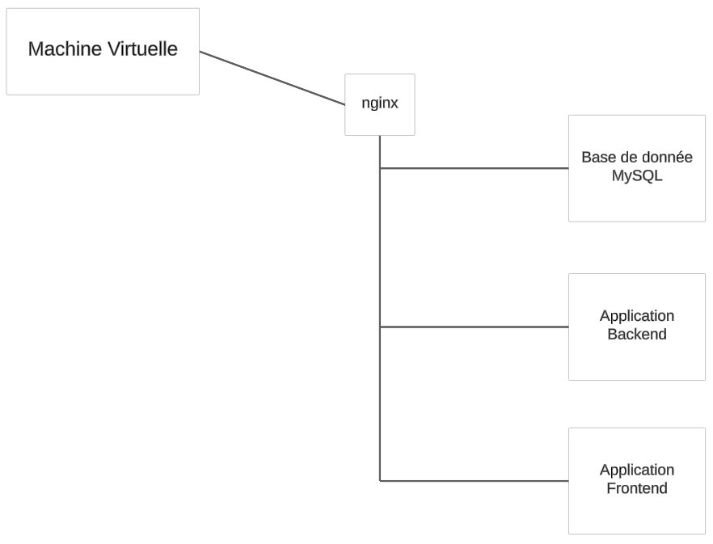

# TP Projet

## Auteur

**CHAPLAIS Alexandre** et **BRAMBAN Kenny**

## Objectifs

- Faciliter le déploiement de l'application à l'aide de conteneurs.
- Faciliter la configurabilité de l'application au déploiement.
- Faciliter la sécurisation de l'application au moment du déploiement.

## Tâches réalisées

Mise en place d'un dockerfile pour le front et un autre pour le back.

## Lancement application

Dans le repertoire api lancer l'application via le **docker-compose.yml** : ```docker compose up```

### Tests Dockerfile

Dans le repertoire front pour lancer le dockerfile du front : ```docker build . -t tlcdoodlefront -f Dockerfile```

Dans le repertoire api pour lancer le dockerfile du back : ```docker build . -t tlcdoodleback -f Dockerfile```

## Déploiement application

Mise en place du déploiement dans le dossier k8s dans /api, pour la partie doodle.

### Diagramme de déploiement


